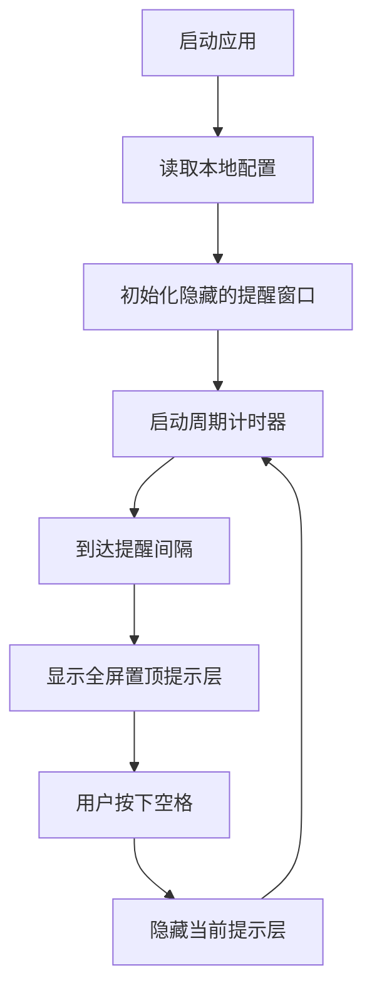

## 1. 产品概述
这是一个极简桌面提醒器，按固定时间间隔弹出全屏提示词，帮助用户快速打断分心状态。
- 面向需要高频强提醒的个人用户，首版聚焦单条提示词、固定间隔提醒、空格关闭
- 目标是提供可直接分发的桌面应用，并为后续托盘、多提示词和开机启动预留扩展空间

## 2. 核心功能
### 2.1 功能模块
1. **提醒主界面**: 启动应用、加载配置、周期性触发提醒
2. **全屏提示层**: 全屏展示提示词、置顶聚焦、监听空格关闭

### 2.2 页面详情
| 页面名称 | 模块名称 | 功能描述 |
|-----------|-------------|---------------------|
| 提醒主界面 | 配置加载 | 启动时读取本地配置，缺省时写入默认提示词和 3 秒间隔 |
| 提醒主界面 | 提醒调度 | 依据配置秒数循环触发提醒窗口显示 |
| 全屏提示层 | 文本展示 | 在全屏覆盖层中央清晰展示当前提示词 |
| 全屏提示层 | 键盘交互 | 用户按下空格键后关闭当前提醒并恢复下一轮等待 |

## 3. 核心流程
应用启动后加载配置并初始化隐藏提醒窗口，然后开始周期计时；到达间隔后将窗口置顶、全屏并聚焦；用户按下空格后隐藏窗口，计时继续运行，等待下一次提醒。

## 4. 用户界面设计
### 4.1 设计风格
- 主色为深色背景与高对比暖色文字，降低界面噪音并强化提醒感
- 按钮样式首版弱化，仅保留文字辅助说明，核心关闭方式为键盘空格
- 字体采用系统无衬线字体，标题超大字号，正文中等字号
- 布局采用桌面优先的全屏居中布局，内容垂直排列
- 图标和装饰从简，避免分散注意力

### 4.2 页面设计概览
| 页面名称 | 模块名称 | UI 元素 |
|-----------|-------------|-------------|
| 提醒主界面 | 后台运行层 | 不强调视觉展示，仅负责生命周期与调度 |
| 全屏提示层 | 提示内容区 | 深色全屏背景、居中文本、轻微发光、底部空格关闭提示 |

### 4.3 响应式策略
采用桌面优先设计，首版主要覆盖 Windows 桌面环境；全屏窗口使用弹性布局自动适配不同分辨率。
