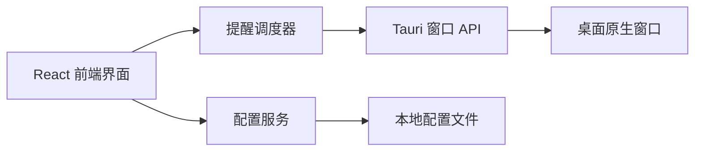
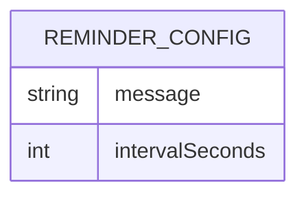

## 1. 架构设计


## 2. 技术描述
- 前端: React 18 + TypeScript + Vite
- 桌面壳: Tauri 2
- 样式: 原生 CSS 变量与模块化组件样式
- 配置存储: Tauri 文件系统插件，将 JSON 配置写入应用配置目录
- 构建工具: npm + cargo

## 3. 路由定义
| 路由 | 用途 |
|-------|---------|
| / | 唯一提醒页面，负责显示提示词和监听空格关闭 |

## 4. API 定义
当前版本不引入独立后端服务，前端直接通过 Tauri 插件访问本地能力。

```ts
export interface ReminderConfig {
  message: string
  intervalSeconds: number
}
```

## 5. 数据模型
### 5.1 数据模型定义


### 5.2 数据定义
配置文件名为 `config.json`，默认内容如下：

```json
{
  "message": "回到当前最重要的事",
  "intervalSeconds": 3
}
```

## 6. 关键实现约束
- 启动后创建单窗口并默认隐藏，避免一开始打断用户
- 定时器运行在前端状态层，显示提醒时调用 Tauri 窗口 API 进行全屏、置顶和聚焦
- 空格关闭仅隐藏当前提醒窗口，不销毁计时状态
- 配置读写与提醒调度解耦，便于后续扩展多提示词和设置页
