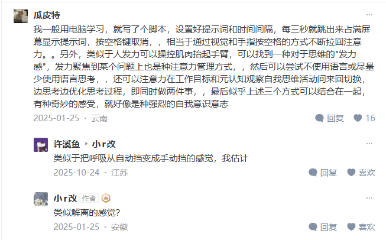

# ADHD Helper · 专注提醒

> 全屏定时提醒工具 — 帮你从分心中拉回来，专注于当前最重要的事。

[](https://www.rust-lang.org/)
[](https://v2.tauri.app/)
[](https://react.dev/)
[](https://www.typescriptlang.org/)
[](https://vite.dev/)
[](https://tailwindcss.com/)

---

## 简介

ADHD Helper 是一款桌面端全屏提醒应用，专为 ADHD 患者或容易分心的场景设计。它按固定时间间隔弹出全屏提示，强制中断当前活动，让你重新聚焦到最重要的事情上。

- **间隔提醒** — 按你设定的秒数周期弹出全屏提示
- **空格即走** — 按 Space 关闭提醒，应用自动回到后台
- **多屏同步** — 所有显示器同时弹出提醒，一个空格全部关闭
- **托盘常驻** — 隐藏在系统托盘，不影响工作流
- **开机自启** — 随 Windows 启动，无需手动开启
- **配置热载** — 修改配置文件后一键重载，无需重启应用
- **极简 UI** — 暗色主题、大字提示，减少视觉干扰

---

## 使用方式

### 1. 下载

从 GitHub Releases 下载最新版 exe，开箱即用：

[**⬇️ 下载 v0.1.0-beta.1**](https://github.com/WindDevil/ADHDHelper/releases/tag/v0.1.0-beta.1)

运行 `adhd_helper_console.exe`（带控制台日志）或 `adhd_helper.exe`（无控制台窗口）即可启动。

### 2. 配置提醒

配置文件位于：

```
Windows: %APPDATA%\com.solo.adhdhelper\config.json
```

内容格式：

```json
{
  "message": "回到当前最重要的事",
  "intervalSeconds": 3
}
```

| 参数                | 说明                   | 默认值                   |
| ------------------- | ---------------------- | ------------------------ |
| `message`         | 提醒文案，任意中英文   | `"回到当前最重要的事"` |
| `intervalSeconds` | 提醒间隔（秒），最小 1 | `3`                    |

修改后点击界面中的 **「重新加载配置」** 按钮即可生效。

### 3. 交互

| 操作                     | 效果                     |
| ------------------------ | ------------------------ |
| 应用自动弹出全屏         | 提醒你回到当前任务       |
| 按**Space**        | 关闭提醒，窗口隐藏到托盘 |
| 左键点击托盘图标         | 手动显示窗口             |
| 右键点击托盘图标 → 退出 | 关闭应用                 |
| 右键 → 开机自启         | 切换开机自启状态         |
| 界面按钮 → 重新加载配置 | 热加载 config.json       |

> 💡 以上步骤已覆盖日常使用的全部操作。如果只是使用这款工具，**无需关注下面的开发与构建内容**。

---

## 自行构建与开发

以下内容面向希望自行编译或参与开发的用户。

### 环境要求

- Node.js 20+
- Rust 1.77+
- [Tauri CLI](https://v2.tauri.app/start/cli/)

### 构建

```bash
# 安装依赖
npm install

# 构建前端
npm run build

# 构建桌面应用
npx tauri build --no-bundle
cd src-tauri && cargo build --release --bin adhd_helper_console
```

### 运行

```bash
# 开发模式（浏览器预览，Tauri IPC 不可用）
npm run dev

# 运行桌面应用（带控制台日志）
./src-tauri/target/release/adhd_helper_console.exe

# 运行桌面应用（无控制台窗口）
./src-tauri/target/release/adhd_helper.exe
```

---

## 技术栈

| 层级             | 技术                                                                         |
| ---------------- | ---------------------------------------------------------------------------- |
| **桌面壳** | [Tauri 2.11](https://v2.tauri.app/) — 原生 Windows 可执行文件                  |
| **后端**   | [Rust 2021](https://www.rust-lang.org/) — 窗口管理、全局快捷键、托盘、文件 I/O |
| **前端**   | [React 18](https://react.dev/) + [TypeScript](https://www.typescriptlang.org/)     |
| **构建**   | [Vite 6](https://vite.dev/)                                                     |
| **样式**   | [Tailwind CSS 3](https://tailwindcss.com/) + 自定义 CSS                         |
| **图标**   | [lucide-react](https://lucide.dev/)                                             |
| **测试**   | [Vitest](https://vitest.dev/)                                                   |
| **包管理** | npm                                                                          |

### 主要 Rust 库

| 库                               | 用途                                |
| -------------------------------- | ----------------------------------- |
| `tauri-plugin-global-shortcut` | 全局 Space 快捷键捕获               |
| `tauri-plugin-autostart`       | 开机自启                            |
| `tauri-plugin-log`             | 日志输出（stdout + 文件 + WebView） |
| `serde` / `serde_json`       | 配置文件序列化                      |

---

## 项目结构

```
adhd-helper/
├── src/                          # 前端源码
│   ├── hooks/useReminderApp.ts   # 核心逻辑：计时器、窗口管理、键盘监听
│   ├── components/               # UI 组件
│   ├── pages/Home.tsx            # 主页面（含多屏检测）
│   ├── services/config.ts        # Tauri IPC 配置加载
│   ├── types/                    # 类型定义
│   └── utils/                    # 工具函数
├── src-tauri/                    # Rust 后端
│   ├── src/lib.rs                # 窗口管理、快捷键、托盘、配置读写
│   ├── src/main.rs               # 发布入口（无控制台）
│   └── src/main_console.rs       # 调试入口（带控制台）
├── package.json
└── vite.config.ts
```

---

## 构建产物

```
src-tauri/target/release/
├── adhd_helper.exe            # 发布版（无控制台窗口）
└── adhd_helper_console.exe    # 调试版（带控制台日志）
```

单文件原生 exe，不依赖 Node.js 或 Python 运行时，开箱即用。

---

## Credits

### 灵感来源

- [知乎回答：ADHD 相关工具与经验分享](https://www.zhihu.com/question/433235573/answer/86138003333) 
  

### 致谢博主

- [小r改](https://www.zhihu.com/people/xu-chang-22-17)
- [瓜皮特](https://www.zhihu.com/people/nature-77-73)

### 构建工具

<p align="left">
  <a href="https://claude.ai/code" target="_blank"></a>
   
  <a href="https://code.visualstudio.com/" target="_blank"></a>
   
  <a href="https://deepseek.com/" target="_blank"></a>
</p>

---

<p align="center"><sub>Built for focus. Made with ❤️.</sub></p>
