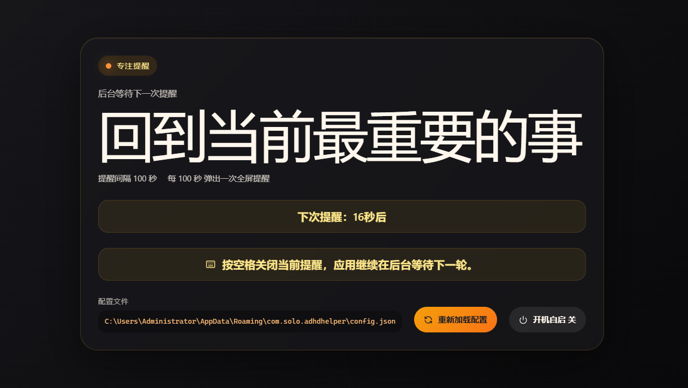

# ADHD Helper：一个帮你从分心中拉回来的全屏提醒工具

> 如果你也经常打开手机想查个东西，半小时后发现自己正在刷短视频——那么这篇文章就是为你写的。

---

那天在知乎刷到一个关于 ADHD 的问题，评论区有人说自己也这样，写了个小工具自己用，每到设定的时间就弹个全屏提醒拉回来。我当时心想：这不就是我需要的吗？

翻了几页，那个人并没有把工具放出来。

那就自己写一个吧。

前前后后做了一天就搞出来了，最开始用的 Trae 的 solo 模式起手，但 solo 里的 GPT 和 Gemini 等得人心烦。正好 DeepSeek 在打折，就换成了 VSCode + Claude Code 插件 + DeepSeek 的方案，一路干到底。

最后做出了 [ADHD Helper](https://github.com/WindDevil/ADHDHelper)。一个极简的全屏提醒工具——按你设定的秒数周期弹全屏提示，按空格关闭，自动循环。现在把它开源出来，希望能帮到和我一样有注意力困扰的人。

---

## 我想要的东西

市面上专注类工具不少：番茄钟、Forest、白噪音……但它们都有一个共同的问题——**太容易被忽略了**。通知栏弹个 toast，瞟一眼就划掉，继续刷。

我真正想要的是这样的：

1. **必须强制打断我**——不是通知栏小纸条，而是直接占满整个屏幕，躲都躲不掉
2. **操作要极简**——不需要解锁手机、点确认、选"再专注5分钟"这些步骤，按一个键就消失
3. **持续循环**——不是设一个25分钟的番茄钟就完事，而是每几十秒到几分钟就提醒一次

市面上没有完全符合的，只能自己写了。

---

## 为什么是 Tauri + Rust + React

AI 当时是这么分析的：

> Electron 打包出来动不动两三百 MB，我就一个全屏弹窗，咽不下这口气。原生 Win32 或 C# WPF 开发效率又太低，而且用 Tailwind 写 UI 确实比写 XAML 舒服太多了。
>
> Tauri 2 正好卡在中间：前端用 React + TypeScript + Vite，开发体验和写网页一样；后端用 Rust，打包出来是一个 8MB 的 exe。前后端通过 IPC 通信，前端调 Rust 命令就像调 API。

说实话这些东西我当时根本没想那么多。我的理由就两个：

一是 **Vibecoding**，AI 说啥就是啥，我就想快点搞出来。

二是我是个 **Rust 孝子**，看到后端用 Rust 写就来劲。

---

## 开发中踩过的一些坑

### 键盘事件传不到 JavaScript —— 这是最大的坑

WebView2 是 Tauri 内置的浏览器内核（和 Edge 同款）。我遇到的问题是：**窗口通过 `hide()` 隐藏再 `show()` 回来后，键盘事件就传不到 JavaScript 了。**

全屏窗口弹出来，按空格想关闭，React 那边根本收不到 `keydown`。试过 `window.addEventListener`、`document.addEventListener`、`capture: true`、手动 `autoFocus`——全都没用。

最后发现根因不在前端，在 WebView2 本身。窗口隐藏再显示时，WebView2 控件的键盘焦点已经丢了，什么监听都救不回来。

解决方案是绕过前端：用 `tauri-plugin-global-shortcut` 在操作系统层面注册全局快捷键。用户按 Space 时完全不经过 WebView2，直接在 Rust 侧捕获。

### 全局快捷键里调用 unregister 会死锁

第一次实现全局快捷键时，我在 handler 回调里调了 `unregister()`，应用直接卡死。原因是插件内部用了一把锁保护注册表，handler 在锁里面执行，`unregister()` 想取同一把锁——自己等自己，死锁了。

修复也简单：handler 里什么都不做，只发一个事件。前端收到事件后通过 `invoke` 在主线程执行窗口操作和注销快捷键。

### 窗口隐藏方式也折腾了几次

最开始用 `hide()` 隐藏窗口，但每次 `show()` 回来后 WebView2 状态都不可靠。换成 `minimize()` 最小化到任务栏会好一些——WebView2 保持活跃，计时器和键盘状态都保留。最后加了系统托盘，改成了隐藏到托盘，任务栏不显示，只占右下角一小块图标。

### 多显示器同步的问题

多显示器场景需要为每个显示器创建一个独立窗口。但每个窗口都是一个独立的 React 实例，各自有自己的定时器。副窗口的定时器触发时也会调用"显示提醒"，导致重复弹窗。

修复方案：副窗口不运行定时器。通过窗口 label 判断自己是主是副，副窗口只做纯展示，所有生命周期由主窗口管理。

---

## 最终是什么样



- 启动后藏在**系统托盘**，任务栏不占位置
- 按设定间隔（比如每 10 秒）在所有显示器上**全屏弹窗**
- 按 **Space** 一键关闭，回到托盘继续等待
- **多显示器同步**：每个屏幕同时弹，一个空格全部收
- 点窗口 **X** 不会关闭应用，只会隐藏到托盘（托盘右键 → 退出才真正退出）
- 支持**开机自启**，界面一键开关
- 改 `config.json` 里的文案和间隔秒数，点**重新加载配置**即可生效，不用重启

配置文件在：`%APPDATA%\com.solo.adhdhelper\config.json`

```json
{
  "message": "回到当前最重要的事",
  "intervalSeconds": 10
}
```

---

## 技术栈

| 层     | 技术                        |
| ------ | --------------------------- |
| 桌面壳 | Tauri 2.11                  |
| 后端   | Rust 2021                   |
| 前端   | React 18 + TypeScript       |
| 构建   | Vite 6                      |
| 样式   | Tailwind CSS 3 + 自定义 CSS |
| 图标   | lucide-react                |

---

## 最后

这个项目让我最深的体会是：**WebView2 是一个浏览器控件，不是窗口管理器。** 如果你想反复隐藏 → 显示 → 全屏 → 抢焦点，WebView2 不是好的选择。但好在 Tauri 的 Rust 后端给了另一条路——前端搞不定的事，绕到系统 API 层面解决反而更可靠。

不管怎么说，工具写出来了，希望能帮到和我一样有注意力困扰的人。欢迎下载试用，有问题或者想法可以提 issue。

特别感谢 [小r改](https://www.zhihu.com/people/xu-chang-22-17) 和 [瓜皮特](https://www.zhihu.com/people/nature-77-73) 两位博主的启发。


---

**项目地址**：[github.com/WindDevil/ADHDHelper](https://github.com/WindDevil/ADHDHelper)

**下载体验**：[Releases](https://github.com/WindDevil/ADHDHelper/releases/tag/v0.1.0-beta.1)

---

*本文使用 Claude Code + VS Code + DeepSeek Reasoner 生成*
